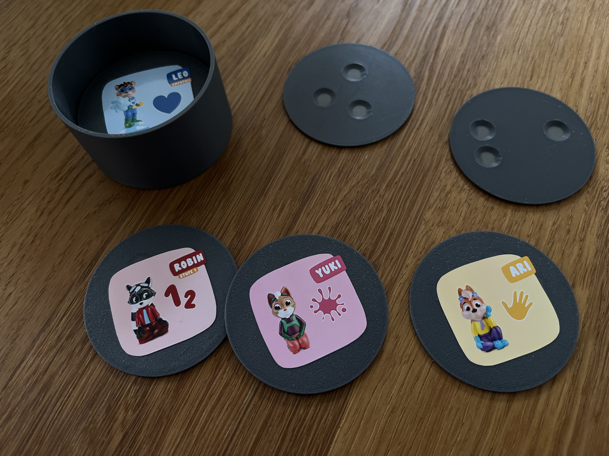

# DIY Edurino Figures & Storage

This repository provides resources for recreating Edurino learning figures and storage solutions. Edurino is an educational toy system that uses conductive figures for interactive learning. Each figure is uniquely identified by three conductive pins positioned at specific distances from each other.

## Repository Contents

- **STL Files**: 3D printable models for:
  - Learning figures compatible with the Edurino system
  - Storage box to organize and protect your figures
- **Measurements**: Detailed pin spacing measurements for each figure
- **Stickers**: Printable figure designs to identify each disk

---


*Example of finished 3D-printed Edurino figures with stickers and storage box.*

---

## Usage Instructions

1. Print the figure disks using the provided STL files
2. Print and cut out the character stickers
3. Apply stickers to the flat part of the disk
4. Open the Edurino app on your device
5. Place your fingers in the three holes of the figure
6. Follow the app's instructions to interact with the learning content

Note: The figures work by using your fingers as conductive elements. Place your fingers firmly in the holes to ensure proper contact with the device's screen.

## 3D Printing

### Figures
The `STL/Figures` directory contains 3D models for each learning figure. These are designed as flat disks with three holes positioned at specific distances from each other, matching the original Edurino figures' pin placements. Instead of using conductive pins, these DIY versions work by guiding your fingers to the correct positions - you place your fingers in the holes to interact with the Edurino app, effectively using your fingers as the conductive pins. Each disk includes a flat surface on top where you can apply the corresponding character sticker for easy identification.

### Storage Box
The `STL/Box` directory contains models for a custom storage solution, designed to safely store and organize your Edurino figures.

### Stickers
Each figure comes with a matching sticker design that can be printed and applied to the flat part of the figure disk. This makes it easy to identify which disk belongs to which character. Print these on sticker paper for best results.

## Pin Measurements

All measurements are in millimeters (mm) and taken from the bottom view, following a clockwise pattern as shown:

```
A--------1------B
  .             |
    .           |
      .         |
        3       2
          .     |
            .   |
              . |
                B

1: Distance between pins A-B
2: Distance between pins B-C
3: Distance between pins C-A
```

### Figure Measurements

| Figure Name | Distance 1 (mm) | Distance 2 (mm) | Distance 3 (mm) | Category |
|------------|---------|---------|---------|-----------|
| Luca (Coding) | 35.0 | 25.0 | 23.0 | Logical Thinking & Coding |
| Luca (Media) | 15.5 | 24.5 | 20.0 | Digital Media Understanding |
| Robin (Math) | 15.0 | 22.5 | 12.5 | Basic Math (up to 10) |
| Leo (Friendship) | 26.5 | 22.5 | 24.0 | Friendship & Social Skills |
| Leo (Emotions) | 20.0 | 18.5 | 16.0 | Emotions |
| Asa (Animals) | 28.5 | 12.5 | 30.5 | Animal World |
| Asa (Nature) | 25.5 | 28.0 | 33.0 | Nature |
| Niki | 18.0 | 18.0 | 18.0 | Basic English |
| Mika (Reading) | 20.0 | 24.0 | 13.5 | Reading & Writing |
| Robin (Numbers) | 26.0 | 27.5 | 19.0 | Numbers & Quantities |
| Alex | 27.5 | 27.0 | 20.0 | Learning Time |
| Ari | 30.0 | 22.0 | 14.0 | Body Parts |
| Mika (Basic) | 38.0 | 32.0 | 22.0 | Basic Skills |
| Yuki | 24.5 | 24.0 | 11.5 | Creativity & Drawing |

Note: Some figures have multiple versions for different difficulty levels (e.g., Robin for Math and Numbers, Mika for Reading and Basic Skills).

⚠️ We're still missing Ollie

## Paper Template Alternative

For those who want to try the system without 3D printing, we provide printable PDF templates in the `Templates` directory. These templates include:
- Full-size figure outlines with marked touch points
- Character stickers
- Instructions for use with the Edurino app

To use the paper templates:
1. Print the template on regular paper
2. Place the paper template on top of your tablet screen
3. Place your fingers on the marked dots on the paper
4. The paper acts as a guide for your finger placement, similar to the 3D printed figures

