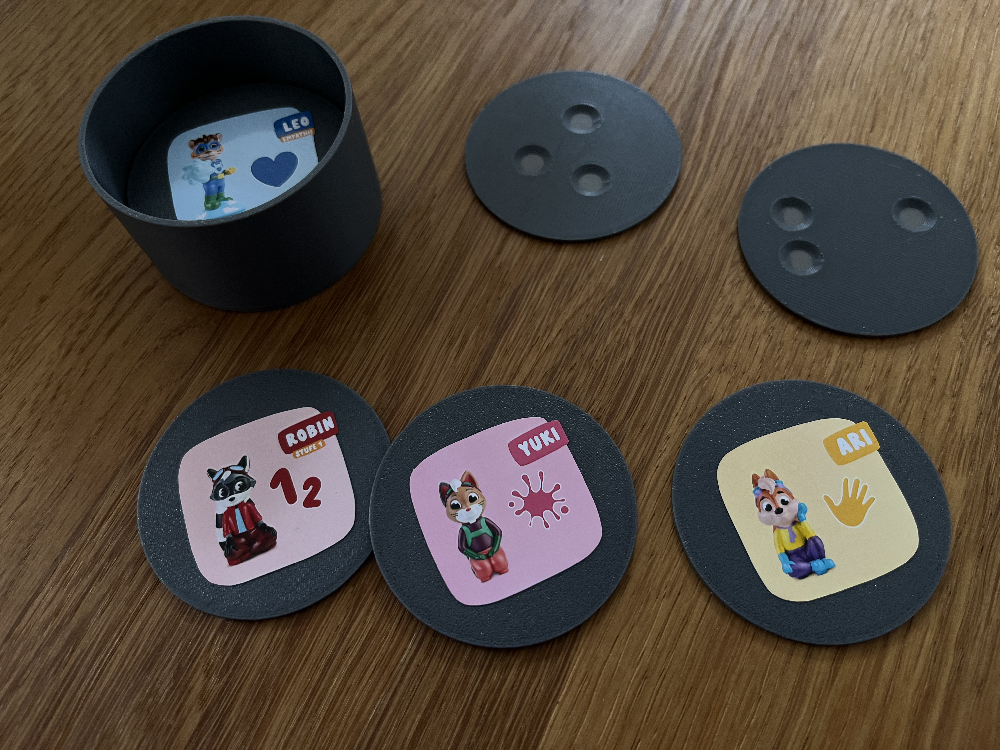

🌍 Verfügbare Sprachen: [English](README.en.md) | [Deutsch](README.md)

# DIY [Edurino](https://www.edurino.com/) Figuren & Aufbewahrung

Dieses Repository bietet Ressourcen zum Nachbauen von Edurino Lernfiguren und Aufbewahrungslösungen. Edurino ist ein pädagogisches Spielsystem, das leitfähige Figuren für interaktives Lernen verwendet. Jede Figur wird durch drei leitfähige Pins identifiziert, die in bestimmten Abständen zueinander positioniert sind.

## Repository-Inhalte

- **STL-Dateien**: 3D-druckbare Modelle für:
  - Lernfiguren, kompatibel mit dem Edurino-System
  - Aufbewahrungsbox zur Organisation und zum Schutz Ihrer Figuren
- **Maße**: Detaillierte Pin-Abstände für jede Figur
- **Aufkleber**: Druckbare Figurendesigns zur Kennzeichnung jeder Scheibe

---


_Beispiel für fertige 3D-gedruckte Edurino-Figuren mit Aufklebern und Aufbewahrungsbox._

---

## Anleitung zur Verwendung

1. Drucken Sie die Figurenscheiben mit den bereitgestellten STL-Dateien
2. Drucken und schneiden Sie die Charakter-Aufkleber aus
3. Bringen Sie die Aufkleber auf der flachen Seite der Scheibe an
4. Öffnen Sie die Edurino-App auf Ihrem Gerät
5. Platzieren Sie Ihre Finger in den drei Löchern der Figur
6. Folgen Sie den Anweisungen der App, um mit den Lerninhalten zu interagieren

Hinweis: Die Figuren funktionieren, indem Ihre Finger als leitfähige Elemente dienen. Platzieren Sie Ihre Finger fest in den Löchern, um einen ordnungsgemäßen Kontakt mit dem Bildschirm des Geräts sicherzustellen.

## 3D-Druck

### Figuren

Das Verzeichnis `STL/Figures` enthält 3D-Modelle für jede Lernfigur. Diese sind als flache Scheiben mit drei Löchern konzipiert, die in bestimmten Abständen zueinander positioniert sind und den Pin-Platzierungen der originalen Edurino-Figuren entsprechen. Anstatt leitfähige Pins zu verwenden, funktionieren diese DIY-Versionen, indem sie Ihre Finger in die richtigen Positionen führen - Sie platzieren Ihre Finger in den Löchern, um mit der Edurino-App zu interagieren, wobei Ihre Finger effektiv als leitfähige Pins dienen. Jede Scheibe hat eine flache Oberseite, auf der Sie den entsprechenden Charakter-Aufkleber zur einfachen Identifizierung anbringen können.

### Aufbewahrungsbox

Das Verzeichnis `STL/Box` enthält Modelle für eine individuelle Aufbewahrungslösung, die zum sicheren Aufbewahren und Organisieren Ihrer Edurino-Figuren konzipiert ist.

### Aufkleber

Jede Figur wird mit einem passenden Aufkleber-Design geliefert, das gedruckt und auf der flachen Seite der Figurenscheibe angebracht werden kann. Dies erleichtert die Identifizierung, welche Scheibe zu welchem Charakter gehört. Drucken Sie diese am besten auf Aufkleberpapier.

## Pin-Maße

Alle Maße sind in Millimetern (mm) angegeben und werden von der Unterseite aus im Uhrzeigersinn gemessen, wie dargestellt:

```
A--------1------B
  .             |
    .           |
      .         |
        3       2
          .     |
            .   |
              . |
                B

1: Abstand zwischen Pins A-B
2: Abstand zwischen Pins B-C
3: Abstand zwischen Pins C-A
```

### Figuren-Maße

| Figurenname            | Abstand 1 (mm) | Abstand 2 (mm) | Abstand 3 (mm) | Kategorie                          |
| ---------------------- | -------------- | -------------- | -------------- | ---------------------------------- |
| Luca (Programmierung)  | 35.0           | 25.0           | 23.0           | Logisches Denken & Programmierung  |
| Luca (Medien)          | 15.5           | 24.5           | 20.0           | Digitales Medienverständnis        |
| Robin (Mathe)          | 15.0           | 22.5           | 12.5           | Grundrechenarten (bis 10)          |
| Leo (Freundschaft)     | 26.5           | 22.5           | 24.0           | Freundschaft & Soziale Kompetenzen |
| Leo (Emotionen)        | 20.0           | 18.5           | 16.0           | Emotionen                          |
| Asa (Tiere)            | 28.5           | 12.5           | 30.5           | Tierwelt                           |
| Asa (Natur)            | 25.5           | 28.0           | 33.0           | Natur                              |
| Niki                   | 18.0           | 18.0           | 18.0           | Grundkenntnisse Englisch           |
| Robin (Zahlen)         | 26.0           | 27.5           | 19.0           | Zahlen & Mengen                    |
| Ari (Körperteile)      | 30.0           | 22.0           | 14.0           | Körperteile                        |
| Ari (Ernährung)        | 12.5           | 25.5           | 31.5           | Gesunde Ernährung                  |
| Mika (Grundlagen)      | 38.0           | 32.0           | 22.0           | Grundfertigkeiten                  |
| Mika (Sätze)           | 24.4           | 30.7           | 31.2           | Wörter & Sätze                     |
| Mika (Lesen)           | 20.0           | 24.0           | 13.5           | Lesen & Schreiben                  |
| Yuki                   | 24.5           | 24.0           | 11.5           | Kreativität & Zeichnen             |
| Yuki (Kunst und Gestalten) | 29.0       | 20.0           | 19.0           | Kunst und Gestalten                |
| Alex (Uhrzeit)         | 27.5           | 27.0           | 20.0           | Uhrzeit lernen                     |
| Alex (Kalender)        | 18.2           | 14.9           | 31.1           | Jahreszeiten & Kalender            |
| Ollie (Aufmerksamkeit) | 18.8           | 21.0           | 22.1           | Aufmerksamkeit & Konzentration     |
| Ollie (Problemlösung)  | 31.6           | 29.3           | 15.9           | Problemlösung                      |
| Robin (Geometrie)      | 32.4           | 32.2           | 12.1           | Geometrie                          |

Hinweis: Einige Figuren haben mehrere Versionen für verschiedene Schwierigkeitsgrade (z.B. Robin für Mathe und Zahlen, Mika für Lesen und Grundfertigkeiten).

## Papier-Vorlage Alternative

Für diejenigen, die das System ohne 3D-Druck ausprobieren möchten, stellen wir druckbare PDF-Vorlagen im Verzeichnis `Templates` zur Verfügung. Diese Vorlagen umfassen:

- Figurenumrisse in Originalgröße mit markierten Berührungspunkten
- Charakter-Aufkleber
- Anleitung zur Verwendung mit der Edurino-App

So verwenden Sie die Papier-Vorlagen:

1. Drucken Sie die Vorlage auf normalem Papier
2. Legen Sie die Papier-Vorlage auf Ihren Tablet-Bildschirm
3. Platzieren Sie Ihre Finger auf den markierten Punkten auf dem Papier
4. Das Papier dient als Führung für Ihre Fingerpositionierung, ähnlich wie die 3D-gedruckten Figuren
